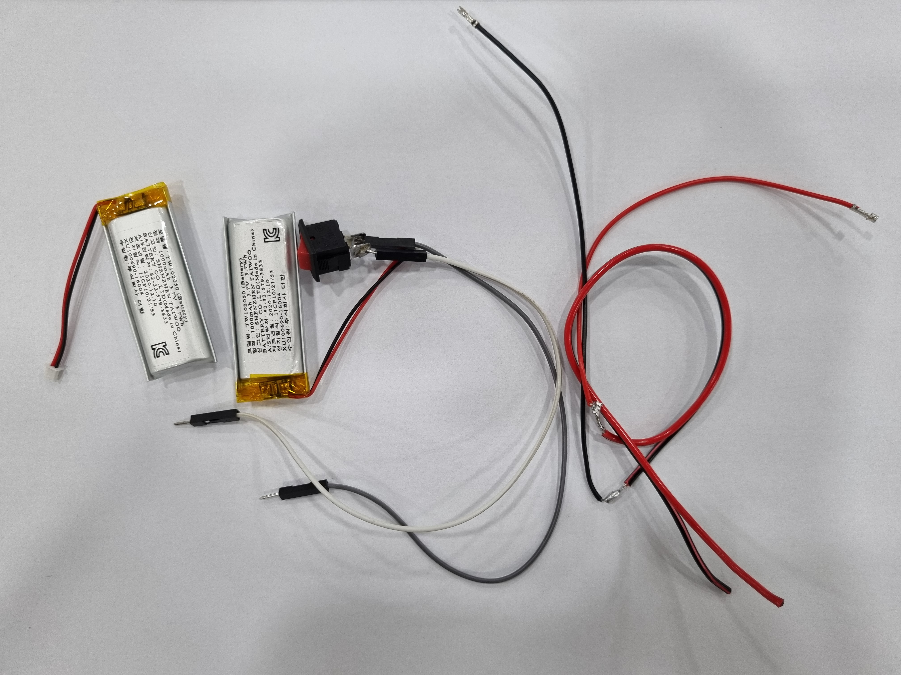
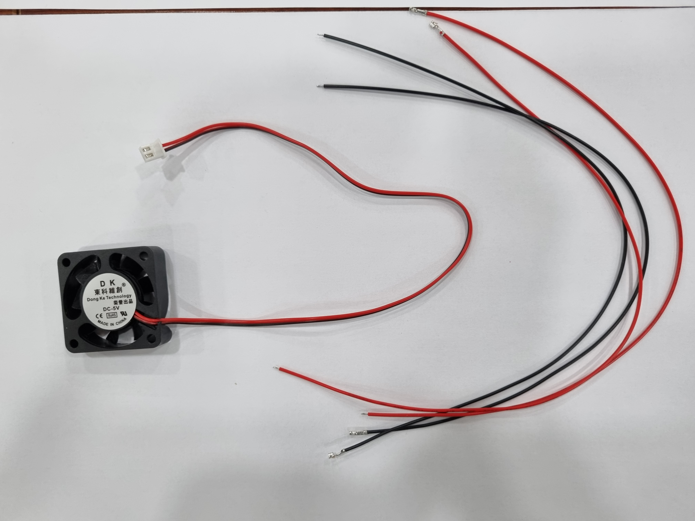
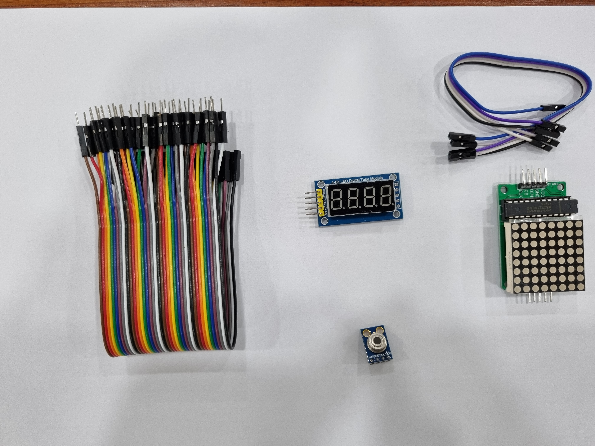

```{r setup, include=FALSE}
knitr::opts_chunk$set(echo = FALSE)
```


-   가빈

    -   컴퓨터 (AI 제어): 아두이노 혹은 라즈베리파이
    -   태양광 패널 (에너지 발생):
    -   디스플레이 (화면):
    -   배터리 (에너지 저장):
    -   팬 (에너지 사용):
    -   와이어링 (연결선):

+-------------------------------------------+-------------------------------------------------+
| 주요 부품                                 | 설명                                            |
+:=========================================:+:================================================+
| {width="200"} | -   솔라 패널 - 태양전지판                      |
|                                           |                                                 |
|                                           | -   50 mA                                       |
|                                           |                                                 |
|                                           | -   5V                                          |
+-------------------------------------------+-------------------------------------------------+
| {width="200"} | -   아두이노 우노                               |
|                                           |                                                 |
|                                           | -   MCU: ATmega328P                             |
|                                           |                                                 |
|                                           | -   동작전압: 보드 동작(5 V), 내부(3.3 V)       |
|                                           |                                                 |
|                                           | -   메모리; Flash(32KB), SRAM(2KB), EEPROM(1KB) |
+-------------------------------------------+-------------------------------------------------+
| {width="200"} | -   품명: TW102050                              |
|                                           |                                                 |
|                                           | -   정격: 1,000 mAh, 3.7 V, 3.7 W/h             |
+-------------------------------------------+-------------------------------------------------+
| {width="200"} | -   팬                                          |
|                                           |                                                 |
|                                           | -   DC-5V                                       |
+-------------------------------------------+-------------------------------------------------+
| {width="200"} | -   디스플레이                                  |
|                                           |                                                 |
|                                           | -   4-Bit LED Digital Tube Module               |
|                                           |                                                 |
|                                           | -                                               |
+-------------------------------------------+-------------------------------------------------+
| {width="200"} | -   컨트롤러                                    |
|                                           |                                                 |
|                                           | -   KCD11                                       |
|                                           |                                                 |
|                                           | -   250V, 3A                                    |
+-------------------------------------------+-------------------------------------------------+
