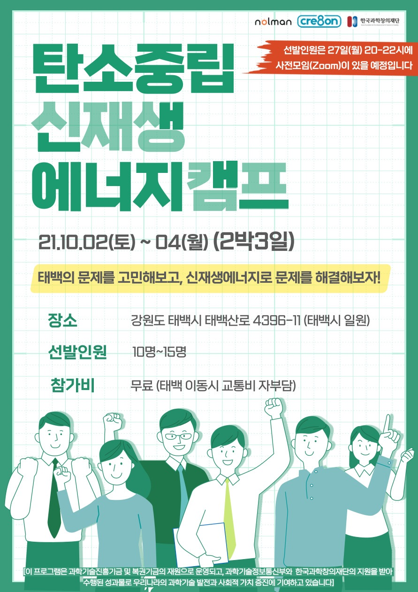

```{r setup, include=FALSE}
knitr::opts_chunk$set(echo = FALSE)
```

# 포스터



# 프로그램

```{r program, eval = TRUE}
library(tidyverse)
library(slickR)

program_image <- fs::dir_ls("fig/nolman/")

program_tbl <- tibble(filename = program_image)

slickR::slickR(obj = program_tbl$filename)
```

