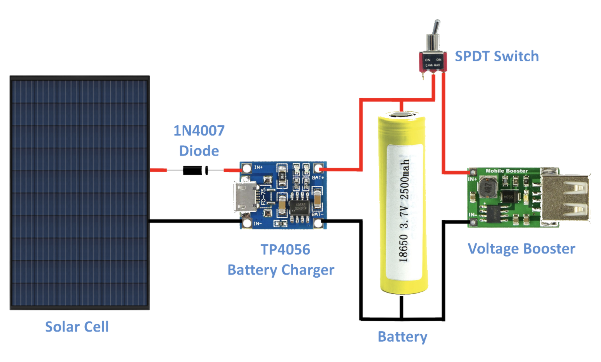

```{r setup, include=FALSE}
knitr::opts_chunk$set(echo = FALSE)
```

# 기구물 3D 프린터

3D 프린터 `stl` 파일을 통해 구현될 제품을 살펴보자.

## 위쪽 부분

```{r stl-3d, webgl=TRUE}
library(rgl)
knitr::knit_hooks$set(webgl = hook_webgl)

top_stl <- readSTL("data/top.stl", col = "blue")
```

- [다운로드(`.stl`)](data/top.stl)
- [다운로드(`.3dm`)](data/top.3dm)

## 회전 부분

```{r stl-3d-circle, webgl=TRUE}
circle_stl <- readSTL("data/circle.stl", col = "blue")
```

- [다운로드(`.stl`)](data/circle.stl)
- [다운로드(`.3dm`)](data/circle.3dm)

## 본체 부분

```{r stl-3d-bottom, webgl=TRUE}
case_stl <- readSTL("data/case.stl", col = "blue")
```

- [다운로드(`.stl`)](data/case.stl)
- [다운로드(`.3dm`)](data/case.3dm)

# 제어 회로 [^fritzing]

[^fritzing]: [fritzing](https://fritzing.org/download/) 다운로드해서 설치함. 

## 디스플레이


## 태양열 발전




